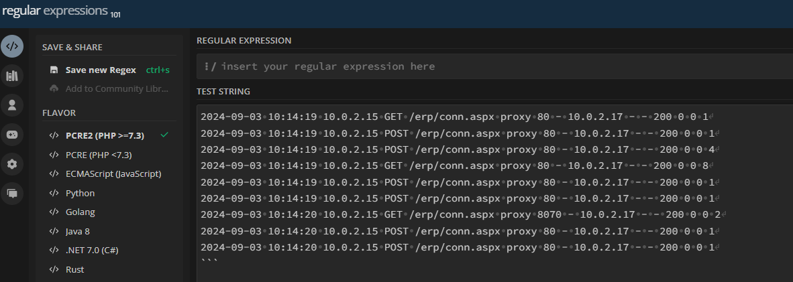

# Lab 1 : Regex (20 min)

Here is a log file
```log
0.0.2.15 GET /erp/conn.aspx proxy 80 - 10.0.2.17 - - 200 0 0 1
2024-09-03 10:14:18 10.0.2.15 POST /erp/conn.aspx proxy 80 - 10.0.2.17 - - 200 0 0 1
2024-09-03 10:14:18 10.0.2.15 GET /erp/conn.aspx proxy 80 - 10.0.2.17 - - 200 0 0 1
2024-09-03 10:14:18 10.0.2.15 POST /erp/conn.aspx proxy 80 - 10.0.2.17 - - 200 0 0 1
2024-09-03 10:14:18 10.0.2.15 POST /erp/conn.aspx proxy 8080 - 10.0.2.17 - - 200 0 0 1
2024-09-03 10:14:18 10.0.2.15 GET /erp/conn.aspx proxy 80 - 10.0.2.17 - - 200 0 0 1
2024-09-03 10:14:18 10.0.2.15 POST /erp/conn.aspx proxy 80 - 10.0.2.17 - - 200 0 0 1
2024-09-03 10:14:18 10.0.2.15 GET /erp/conn.aspx proxy 80 - 10.0.2.17 - - 200 0 0 1
2024-09-03 10:14:18 10.0.2.15 POST /erp/conn.aspx proxy 80 - 10.0.2.17 - - 200 0 0 1
2024-09-03 10:14:18 10.0.2.15 POST /erp/conn.aspx proxy 80 - 10.0.2.17 - - 200 0 0 1
2024-09-03 10:14:18 10.0.2.15 GET /erp/conn.aspx proxy 80 - 10.0.2.17 - - 200 0 0 1
2024-09-03 10:14:18 10.0.2.15 POST /erp/conn.aspx proxy 80 - 10.0.2.17 - - 200 0 0 1
2024-09-03 10:14:18 10.0.2.15 GET /erp/conn.aspx proxy 80 - 10.0.2.17 - - 200 0 0 1
2024-09-03 10:14:18 10.0.2.15 POST /erp/conn.aspx proxy 80 - 10.0.2.17 - - 200 0 0 1
2024-09-03 10:14:18 10.0.2.15 GET /erp/conn.aspx proxy 80 - 10.0.2.17 - - 200 0 0 1
2024-09-03 10:14:19 10.0.2.15 POST /erp/conn.aspx proxy 80 - 10.0.2.17 - - 200 0 0 1
2024-09-03 10:14:19 10.0.2.15 GET /erp/conn.aspx proxy 80 - 10.0.2.17 - - 200 0 0 0
2024-09-03 10:14:19 10.0.2.15 POST /erp/conn.aspx proxy 80 - 10.0.2.17 - - 200 0 0 1
2024-09-03 10:14:19 10.0.2.15 GET /erp/conn.aspx proxy 80 - 10.0.2.17 - - 200 0 0 0
2024-09-03 10:14:19 10.0.2.15 POST /erp/conn.aspx proxy 8800 - 10.0.2.17 - - 200 0 0 1
2024-09-03 10:14:19 10.0.2.15 GET /erp/conn.aspx proxy 80 - 10.0.2.17 - - 200 0 0 2
2024-09-03 10:14:19 10.0.2.15 POST /erp/conn.aspx proxy 80 - 10.0.2.17 - - 200 0 0 1
2024-09-03 10:14:19 10.0.2.15 GET /erp/conn.aspx proxy 8080 - 10.0.2.17 - - 200 0 0 1
2024-09-03 10:14:19 10.0.2.15 GET /erp/conn.aspx proxy 80 - 10.0.2.17 - - 200 0 0 1
2024-09-03 10:14:19 10.0.2.15 POST /erp/conn.aspx proxy 80 - 10.0.2.17 - - 200 0 0 1
2024-09-03 10:14:19 10.0.2.15 POST /erp/conn.aspx proxy 80 - 10.0.2.17 - - 200 0 0 1
2024-09-03 10:14:19 10.0.2.15 GET /erp/conn.aspx proxy 80 - 10.0.2.17 - - 200 0 0 1
2024-09-03 10:14:19 10.0.2.15 POST /erp/conn.aspx proxy 80 - 10.0.2.17 - - 200 0 0 1
2024-09-03 10:14:19 10.0.2.15 POST /erp/conn.aspx proxy 80 - 10.0.2.17 - - 200 0 0 4
2024-09-03 10:14:19 10.0.2.15 GET /erp/conn.aspx proxy 80 - 10.0.2.17 - - 200 0 0 8
2024-09-03 10:14:19 10.0.2.15 POST /erp/conn.aspx proxy 80 - 10.0.2.17 - - 200 0 0 1
2024-09-03 10:14:19 10.0.2.15 POST /erp/conn.aspx proxy 80 - 10.0.2.17 - - 200 0 0 1
2024-09-03 10:14:20 10.0.2.15 GET /erp/conn.aspx proxy 8070 - 10.0.2.17 - - 200 0 0 2
2024-09-03 10:14:20 10.0.2.15 POST /erp/conn.aspx proxy 80 - 10.0.2.17 - - 200 0 0 1
2024-09-03 10:14:20 10.0.2.15 POST /erp/conn.aspx proxy 80 - 10.0.2.17 - - 200 0 0 1
```

Your goal is to have a field "port" in your favourite SIEM that show only the port number. You need to extract the port from the log using Regular Expression

- 1) Use the [regex101](https://regex101.com/) website to craft your regex
- 2) Insert a simple of the log into the "test strings" area { align=center }
- 3) Craft your query (without IA for the moment), if you are novice using regex [regex ressources](https://www.asic-world.com/scripting/regular_expression1.html)
- 4) Test your query, step by step into the "regular expression" area to see if you catch is good or not
- 5) If you struggle and you try at least 10 min to craft your query alone, use your favourite IA platform to craft the query 